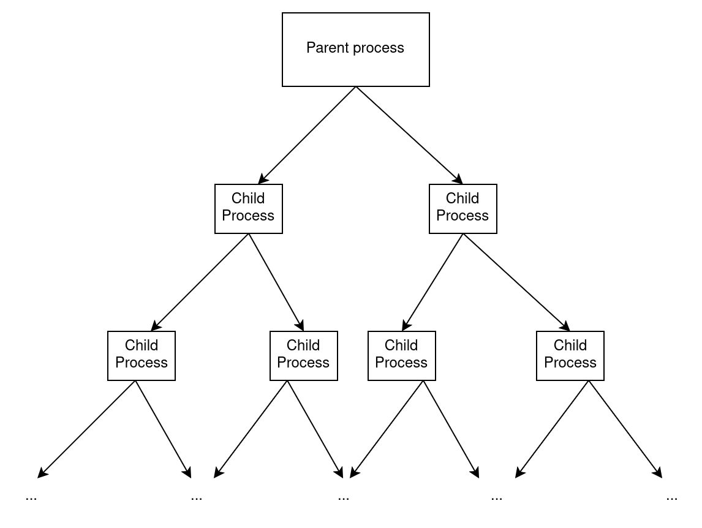

# Challenge 3: Fork Bomb Prevention
While diving into OS concepts, you came across a mysterious executable named “fbomb” Intrigued by the name, you decided to download it, thinking it might offer some valuable insights. But instead of executing it immediately, your sharp instincts told you to pause. After all, you knew the risks of running unverified files.

Curious about its potential harm, you investigated further and quickly realized that the file contained a fork bomb—an aggressive piece of code that spawns an overwhelming number of processes, draining CPU and memory resources until the system collapses. Once executed, a hard reboot is typically the only solution.

Rather than panic, you took immediate action. Leveraging your knowledge of Linux and eBPF, you decided to implement an eBPF program to neutralize the fork bomb.

This challenge requires eBPF maps.

## Description
The fork bomb you are about to deal with works as follows:

1. A function named “fork_bomb” is called.
2. This function creates 2 child processes.
- Each child process calls the “fork_bomb” function again -> step 1.
- The parent process waits for the child processes to finish.



You thus end up with a tree of processes, where each process has 2 children. Each process waits for its children to die before dying itself.

You will need to kill all the processes at a specific depth in such a way that all the children will be killed as well, and all their parents too since they were waiting for them. Therefore, the fork bomb will stop.

You want to detect only the fork bomb and avoid interfering with normal behavior on your system that generates many processes. To achieve this, a process “P” will only be terminated if it meets all of the following criteria:

1. It is trying to create a process via the `clone` system call.
2. It shares the same name as its ancestor, with a separation of X generations (e.g., if X = 1, it has the same name as its direct parent).
3. Its ancestor (with the same X-generation separation) was created within Y nanoseconds before process “P” calls the `clone` system call.

If these criteria are met, the process “P” is killed.

### Note

Our forkbomb uses the `clone` syscall instead of the `fork` syscall, but you can consider that they are (almost) the same thing for this project.

## Setup
Download the files for this challenge using:
```
$ wget --no-check-certificate https://people.montefiore.uliege.be/~gain/courses/info0940/asset/forkbomb.tar.gz
$ tar -xzvf forkbomb.tar.gz
```
The fork bomb is located in `forkbomb/forkbomb`.

You can compile it using the Makefile provided (simply run `make` within the `forkbomb/forkbomb` directory).

There is a protection mechanism in place that will prevent going deeper than depth 12. You can remove it or change it if you want, but you might end up needing to reboot your system.

You can run the fork bomb using the following command:

---
### Danger
- DO NOT run this program **on your host machine** if you removed the protection mechanism. It will create a lot of processes and might crash your system.
- Do not run this program if you are **emulating** your virtual machine (mainly for mac users). Even 12 generations of processes can be (will be) too much for your VM.
---

```
$ ./fbomb
```
Inside `forkbomb/src`, you will find the same template as in tutorial 3. Use it to implement the eBPF program that prevents the forkbomb to succeed.

## What you need to do
You are expected to implement an eBPF program that detects when a fork bomb is happening and kills it by killing all processes of a specific depth.

It will detect the fork bomb by checking the criteria mentioned above. But these criteria need to be configurable when loading the eBPF program (using the `ecli` command). The arguments are the following:

- `--ancestor_separations`: Specifies the number of generations between the process (invoking the clone syscall) and its ancestor that must share the same name. Default should be 3.

- `--time_separation_ns`: The time in nanoseconds that the process should use the `clone` syscall after its ancestor’s creation (the ancestor as determined by `ancestor_separations`) . Default should be 1000000000 nanoseconds (1 second).
---
### Important

If your VM is quite slow, you might need to increase the time_separation_ns value even when the value of ancestor_separations is not very high (e.g. 5 or 6).

---

For example, consider this launch command:
```
$ sudo ecli src/package.json --ancestor_separations 2 --time_separation_ns 1000000000
```
Launching the fork bomb should look like this:
```
$ ./fbomb
Depth 0
Depth 1
Depth 1
Depth 2
Depth 2
Depth 2
Depth 2
```
Indeed, once the processes at depth 2 call the “fork_bomb” function, “Depth 2” is printed. But when they try to create a new process, the eBPF program will kill them. Therefore, no process at depth 3 will be created.

## Tip

In order to avoid killing the wrong process, you could filter its name. If it is not named “fbomb”, print something in the log instead of killing it for example.

---
### Danger

**This is just to help you during development. You should not filter the name of the process in the final solution.**